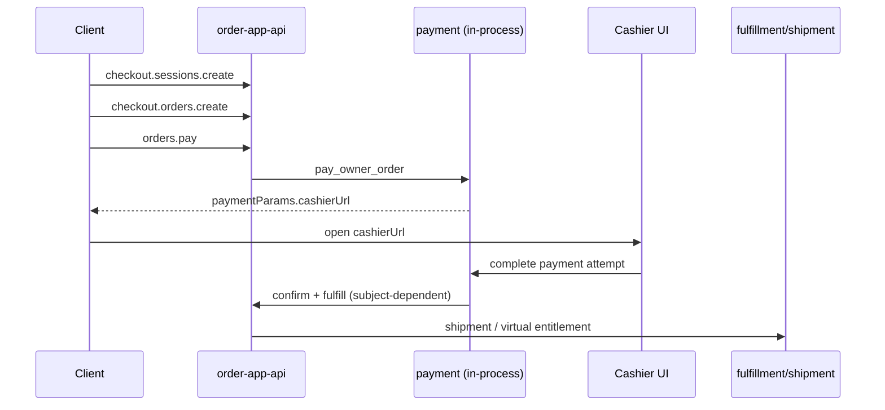
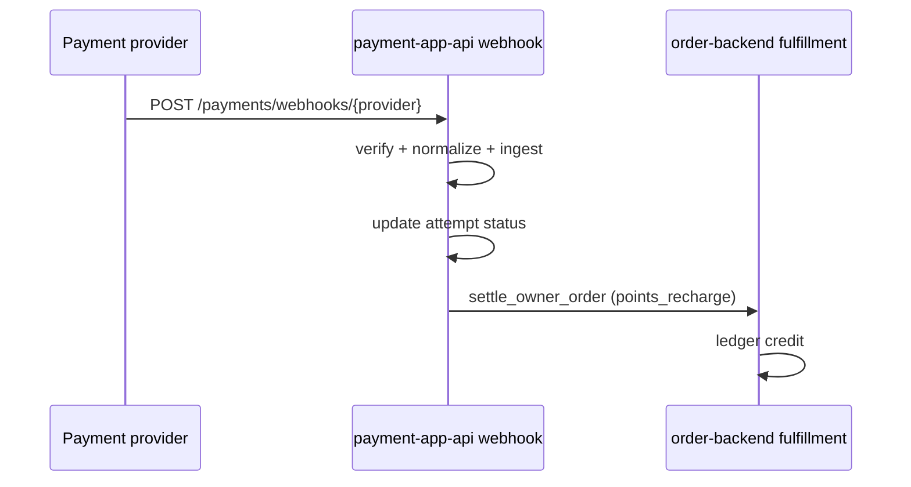
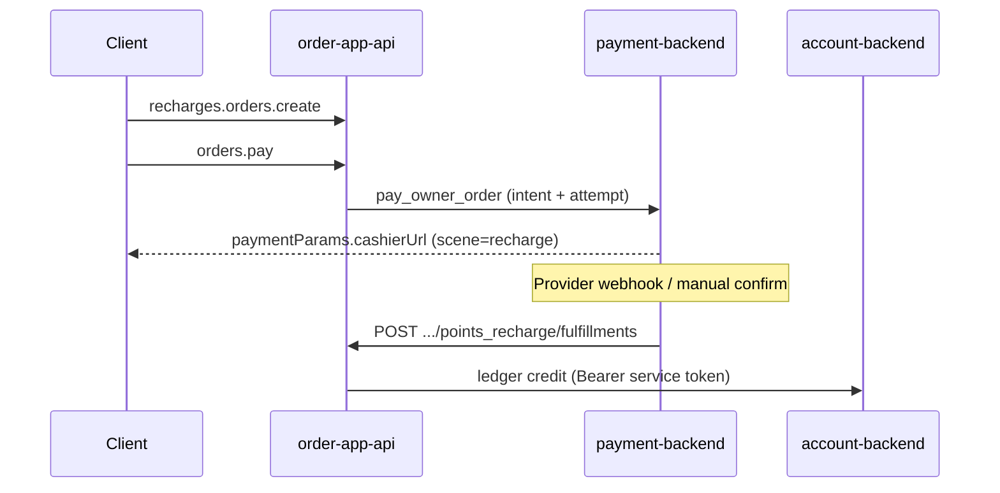

# Commerce Checkout and Payment Architecture

Status: active  
Owner: SDKWork maintainers  
Updated: 2026-07-05  
Machine contract: `specs/commerce-checkout-topology.spec.json`

## 1. Capability Boundaries

| Capability | Repository | Role |
| --- | --- | --- |
| **Order** | `sdkwork-order` | Unified order center: create/list/pay/cancel orders, checkout sessions, recharge packages, fulfillment sagas |
| **Payment** | `sdkwork-payment` | Payment executor: intents, attempts, provider channels, refunds, webhook ingestion, owner-order confirmation |

**Dependency direction:** `sdkwork-order` depends on `sdkwork-payment` (in-process `OwnerOrderPaymentStore` for standalone gateway; HTTP when gateways are split). Payment never creates `commerce_order` rows.

## 2. End-to-End Flows

### 2.1 Product checkout (mall / physical goods)

### 2.3 Provider webhook (production)

### 2.2 Points recharge

Canonical backend fulfillment path (snake_case):

`POST /backend/v3/api/orders/{orderId}/points_recharge/fulfillments`

## 3. Cashier URL Contract

Cashier deep-links are built by `sdkwork-utils-rust`:

- `commerce_cashier_base_url()` — env `SDKWORK_COMMERCE_CASHIER_BASE_URL`, default `https://im.sdkwork.com/cashier`
- `commerce_cashier_scene(order_subject)` — maps `points_recharge` → `recharge`, `product` → `checkout`
- `build_commerce_cashier_url(scene, order_id, out_trade_no)`

`orders.pay` and recharge pay outcomes expose:

| `paymentParams` key | Meaning |
| --- | --- |
| `cashierUrl` | Full deep-link for cashier UI |
| `nextAction` | Always `cashier` when redirect is required |
| `orderSn` | Business order number (`order_no`) |
| `cashierScene` | `recharge`, `checkout`, or `virtual` |
| `qrCodePayload` | Same as `cashierUrl` for scan-to-pay |

**Wire note:** `orderId` in the URL is the business `order_no`, not the internal UUID.

## 4. Client Architecture by Platform

All application packages **must** consume composed SDKs (`@sdkwork/order-app-sdk`, `@sdkwork/payment-app-sdk`). Raw HTTP and generator transport package names are forbidden per `APP_SDK_INTEGRATION_SPEC.md` section 9.

### 4.1 PC (React / Vite)

| Concern | Implementation |
| --- | --- |
| Order center (standalone) | `apps/sdkwork-order-pc` — list, detail, pay, cancel |
| Order center (composed) | `sdkwork-mall-pc-checkout`, `sdkwork-account-pc-wallet` embed `@sdkwork/order-app-sdk` |
| Checkout | `sdkwork-mall-pc-checkout` — `checkout.*` + `recharges.*` |
| Cashier | `sdkwork-payment-pc` or host shell route; navigate to `paymentParams.cashierUrl` after `orders.pay` |
| Service wiring | `apps/sdkwork-order-common/packages/sdkwork-order-service` facade over SDK ports |

### 4.2 H5 (Capacitor / WeChat H5)

| Concern | Implementation |
| --- | --- |
| Order center | Host app package imports `@sdkwork/order-app-sdk`; routes mirror PC order list/detail |
| Checkout | Same `checkout.*` / `recharges.*` operations; session from `sdkwork.app.config.json` |
| Cashier | Shared H5 cashier page at cashier base URL; query params from `paymentParams` |
| Auth | IAM session (`AuthToken` / `Access-Token`) per OpenAPI |

### 4.3 Flutter

| Concern | Implementation |
| --- | --- |
| Order center | Dart consumer over order open-api (generated or thin composed facade) |
| Checkout | Port TypeScript SDK operation IDs; same request/response envelope |
| Cashier | `WebView` loading `cashierUrl`, or native bridge to payment SDK when available |
| Config | `dart-define` / manifest per `sdkwork-dev-config` skill |

### 4.4 Backend / service-to-service

| Call | Auth |
| --- | --- |
| Payment → order fulfillment | `SDKWORK_PAYMENT_ORDER_SERVICE_AUTH_TOKEN` (Bearer) |
| Order → account credit | `SDKWORK_ORDER_ACCOUNT_SERVICE_AUTH_TOKEN` (Bearer) |

Env origins: `SDKWORK_ORDER_BACKEND_API_ORIGIN`, payment gateway base URL from app config.

## 5. API Surface Map

| Operation group | App prefix | Primary SDK |
| --- | --- | --- |
| Orders | `/app/v3/api/orders` | `@sdkwork/order-app-sdk` → `orders.*` |
| Recharges | `/app/v3/api/recharges` | `@sdkwork/order-app-sdk` → `recharges.*` |
| Checkout | `/app/v3/api/checkout` | `@sdkwork/order-app-sdk` → `checkout.*` |
| Payments | `/app/v3/api/payments` | `@sdkwork/payment-app-sdk` |
| Admin orders | `/backend/v3/api/orders` | `@sdkwork/order-backend-sdk` |
| Payment confirm | `/backend/v3/api/payments` | `@sdkwork/payment-backend-sdk` |

## 6. Idempotency and Pagination

- Pay and fulfillment commands require `requestNo` + `idempotencyKey` headers per OpenAPI.
- List endpoints use `SdkWorkListQuery` (`page`, `page_size`; default 20, max 200).
- Success envelope: `SdkWorkApiResponse` with `code: 0`, `data`, `traceId`.

## 7. Related Specs

- Recharge boundary: `specs/commerce-recharge.spec.json`
- Payment boundary: `../sdkwork-payment/specs/commerce-boundary.spec.json`
- Recharge narrative: `specs/RECHARGE_ORDER_SPEC.md`
- Integrator guide: `docs/guides/integrator/README.md`
