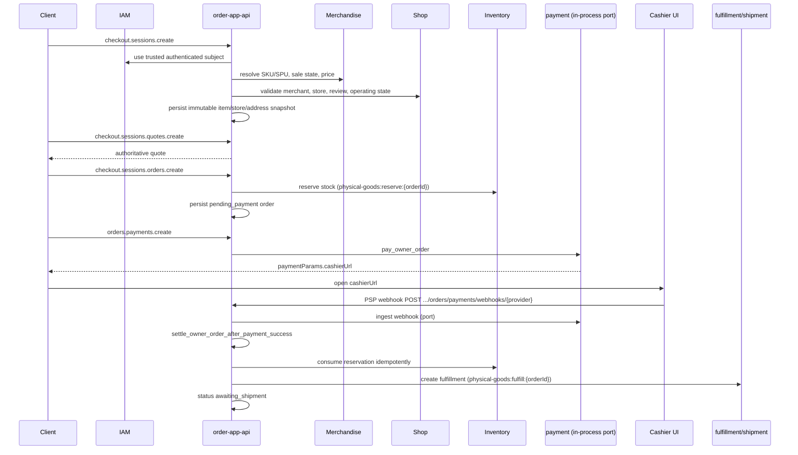
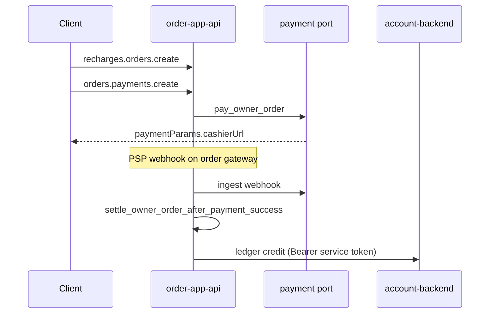
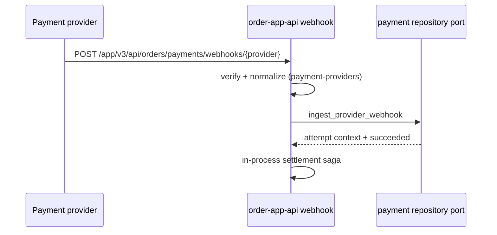
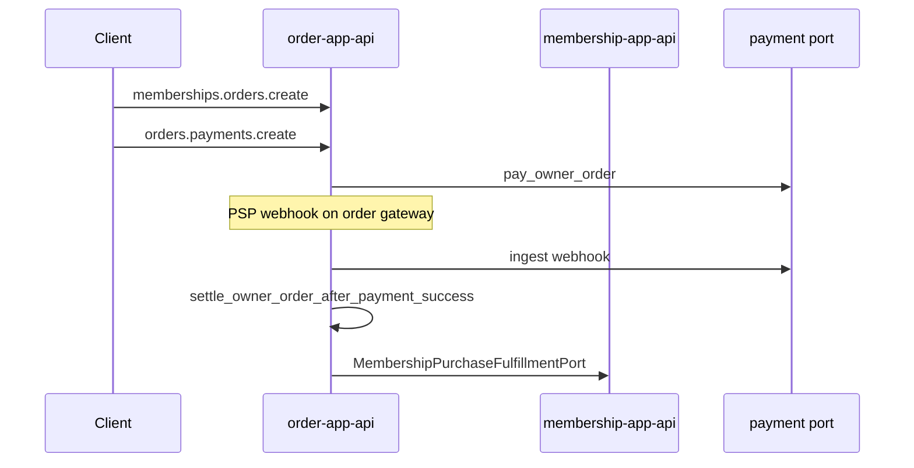

# Commerce Checkout and Payment Architecture

Status: active  
Owner: SDKWork maintainers  
Updated: 2026-07-30
Machine contracts: `specs/commerce-checkout-topology.spec.json`, `specs/commerce-payment-webhook.spec.json`

## 1. Capability Boundaries

| Capability | Repository | Role |
| --- | --- | --- |
| **Order** | `sdkwork-order` | Unified order center: checkout, pay orchestration, **PSP webhook ingestion**, payment settlement, fulfillment sagas |
| **Payment** | `sdkwork-payment` | Payment executor: intents, attempts, provider channels, refunds; **webhook event persistence via port only** |
| **Merchandise** | `sdkwork-merchandise` | Authoritative SKU/SPU, sale state, and price lookup |
| **Shop** | `sdkwork-shop` | Store, merchant, review, operating-state, and ownership validation |
| **IAM** | `sdkwork-iam` | Authenticated buyer identity; client-supplied owner identity is never trusted |
| **Inventory** | `sdkwork-inventory` | Physical stock reservation, consumption, and release through the inventory port |
| **Fulfillment** | `sdkwork-logistics` / host adapter | Shipment-order creation after confirmed payment |

**Dependency direction:** Order orchestrates one-way ports to the domain owners. Payment MUST NOT depend on Order (no HTTP callbacks and no order service imports in payment route crates). Account does not participate in an ordinary PSP-funded physical-goods purchase unless a future flow explicitly adds balance payment, points deduction, or an account hold.

## 2. End-to-End Flows

### 2.1 Product checkout (mall / physical goods)

```mermaid
sequenceDiagram
    participant Client
    participant IAM
    participant Order as order-app-api
    participant Merchandise
    participant Shop
    participant Inventory
    participant Payment as payment (in-process port)
    participant Cashier as Cashier UI
    participant Fulfill as fulfillment/shipment

    Client->>Order: checkout.sessions.create
    Order->>IAM: use trusted authenticated subject
    Order->>Merchandise: resolve SKU/SPU, sale state, price
    Order->>Shop: validate merchant, store, review, operating state
    Order->>Order: persist immutable item/store/address snapshot
    Client->>Order: checkout.sessions.quotes.create
    Order-->>Client: authoritative quote
    Client->>Order: checkout.sessions.orders.create
    Order->>Inventory: reserve stock (physical-goods:reserve:{orderId})
    Order->>Order: persist pending_payment order
    Client->>Order: orders.payments.create
    Order->>Payment: pay_owner_order
    Payment-->>Client: paymentParams.cashierUrl
    Client->>Cashier: open cashierUrl
    Cashier->>Order: PSP webhook POST .../orders/payments/webhooks/{provider}
    Order->>Payment: ingest webhook (port)
    Order->>Order: settle_owner_order_after_payment_success
    Order->>Inventory: consume reservation idempotently
    Order->>Fulfill: create fulfillment (physical-goods:fulfill:{orderId})
    Order->>Order: status awaiting_shipment
```

The first production slice intentionally accepts one merchant and one store per order. Duplicate SKU lines are rejected before persistence. Order stores immutable buyer-visible and settlement-critical snapshots (address, SKU/SPU, unit price, store, and merchant); later catalog or store edits do not rewrite an existing order.

### 2.2 Points recharge

```mermaid
sequenceDiagram
    participant Client
    participant Order as order-app-api
    participant Payment as payment port
    participant Account as account-backend

    Client->>Order: recharges.orders.create
    Client->>Order: orders.payments.create
    Order->>Payment: pay_owner_order
    Payment-->>Client: paymentParams.cashierUrl
    Note over Order: PSP webhook on order gateway
    Order->>Payment: ingest webhook
    Order->>Order: settle_owner_order_after_payment_success
    Order->>Account: ledger credit (Bearer service token)
```

### 2.3 Provider webhook (production)

```mermaid
sequenceDiagram
    participant PSP as Payment provider
    participant Order as order-app-api webhook
    participant Payment as payment repository port

    PSP->>Order: POST /app/v3/api/orders/payments/webhooks/{provider}
    Order->>Order: verify + normalize (payment-providers)
    Order->>Payment: ingest_provider_webhook
    Payment-->>Order: attempt context + succeeded
    Order->>Order: in-process settlement saga
```

Manual operator replay: `POST /backend/v3/api/orders/{orderId}/payment_confirmations`. It queries the original provider account, validates provider success, merchant order number, amount, and currency, and then enters the same `settle_owner_order_after_payment_success` function as the webhook. Provider I/O happens before the short payment confirmation transaction. Order-only replay returns conflict when multiple attempts make the target ambiguous.

### 2.4 Membership purchase

Order center **creates** `commerce_order` with `subject=membership` (checkout or membership-subject order create — parallel to `recharges.orders.create`). Membership **must not** insert `commerce_order` in production paths.

```mermaid
sequenceDiagram
    participant Client
    participant Order as order-app-api
    participant Membership as membership-app-api
    participant Payment as payment port

    Client->>Order: memberships.orders.create
    Client->>Order: orders.payments.create
    Order->>Payment: pay_owner_order
    Note over Order: PSP webhook on order gateway
    Order->>Payment: ingest webhook
    Order->>Order: settle_owner_order_after_payment_success
    Order->>Membership: MembershipPurchaseFulfillmentPort
```

**Dependency:** `sdkwork-order` → `sdkwork-membership` via fulfillment port at gateway assembly (same pattern as order → account for points recharge). Payment remains a foundation module with no order or membership dependencies.

Authority: `../sdkwork-membership/specs/COMMERCE_ORDER_BOUNDARY_SPEC.md`, `../sdkwork-membership/specs/commerce-order-membership-boundary.spec.json`.

### 2.5 Checkout money and merchandise scope

- `CommerceMoney`, merchandise `price_amount`, checkout snapshots, quotes, order items, and order amount breakdowns use non-negative integer smallest-unit strings. For example, CNY `69.90` is stored and processed as `"6990"`.
- Checkout copies the merchandise SKU price snapshot without major-unit conversion. Application boundaries such as Notary may convert display major units to and from minor units, but Order never performs that conversion internally.
- Line multiplication and quote summation use checked integer arithmetic. Invalid decimals, non-positive quantities, and `i64` overflow fail the transaction without partial checkout or idempotency rows; amounts are never rounded, saturated, or converted through `f64`.
- Canonical zero is `"0"`, including discount and tax defaults. Decimal zero strings such as `"0.00"` are not valid `CommerceMoney` values.
- SKU resolution is scoped by `tenant_id` and exact-or-null `organization_id` before the price is snapshotted. A checkout cannot consume another organization's SKU even when the tenant is the same.

## 3. Cashier URL Contract

Cashier deep-links are built by `sdkwork-utils-rust`:

- `commerce_cashier_base_url()` — env `SDKWORK_COMMERCE_CASHIER_BASE_URL`, default `https://im.sdkwork.com/cashier`
- `commerce_cashier_scene(order_subject)` — maps `points_recharge` → `recharge`, `product` → `checkout`
- `build_commerce_cashier_url(scene, order_id, out_trade_no)`

`orders.payments.create` and recharge pay outcomes expose:

| `paymentParams` key | Meaning |
| --- | --- |
| `cashierUrl` | Full deep-link for cashier UI |
| `nextAction` | Always `cashier` when redirect is required |
| `orderSn` | Business order number (`order_no`) |
| `cashierScene` | `recharge`, `checkout`, or `virtual` |
| `qrCodePayload` | Same as `cashierUrl` for scan-to-pay |

**Wire note:** `orderId` in the URL is the business `order_no`, not the internal UUID.

## 4. Client Architecture by Platform

All application packages **must** consume composed SDKs (`@sdkwork/order-app-sdk`, `@sdkwork/payment-app-sdk`). Raw HTTP and generator transport package names are forbidden per `APP_SDK_INTEGRATION_SPEC.md` section 9.

### 4.1 PC (React / Vite)

| Concern | Implementation |
| --- | --- |
| Order center (standalone) | `apps/sdkwork-order-pc` — list, detail, pay, cancel |
| Order center (composed) | `sdkwork-mall-pc-checkout`, `sdkwork-account-pc-wallet` embed `@sdkwork/order-app-sdk` |
| Checkout | `sdkwork-mall-pc-checkout` — `checkout.*` + `recharges.*` |
| Cashier | `sdkwork-payment-pc` or host shell route; navigate to `paymentParams.cashierUrl` after `orders.payments.create` |
| Service wiring | `apps/sdkwork-order-common/packages/sdkwork-order-service` facade over SDK ports |

### 4.2 Backend / service-to-service

| Call | Auth |
| --- | --- |
| Order → account credit | `SDKWORK_ACCESS_TOKEN` (Bearer) |

PSP notify URLs MUST target the **order gateway**, not payment:

`{ORDER_PAYMENT_WEBHOOK_BASE_URL}/app/v3/api/orders/payments/webhooks/{providerCode}`

## 5. API Surface Map

| Operation group | App prefix | Primary SDK |
| --- | --- | --- |
| Orders | `/app/v3/api/orders` | `@sdkwork/order-app-sdk` → `orders.*` |
| Payment webhooks | `/app/v3/api/orders/payments/webhooks` | order gateway (PSP-facing) |
| Recharges | `/app/v3/api/recharges` | `@sdkwork/order-app-sdk` → `recharges.*` |
| Checkout | `/app/v3/api/checkout` | `@sdkwork/order-app-sdk` → `checkout.*` |
| Payments (execute) | in-process port from order | `@sdkwork/payment-app-sdk` for cashier reads |
| Admin orders | `/backend/v3/api/orders` | `@sdkwork/order-backend-sdk` |

## 6. Idempotency and Pagination

- App write commands require `Idempotency-Key`. The server binds the key to a canonical request fingerprint; same-key/same-command replays return the durable result, while same-key/different-command replays fail with conflict.
- Provider webhook events are deduplicated by the provider event identity and remain correlated to the exact persisted payment attempt. Webhook and active-query recovery converge on the same payment-success settlement function.
- Inventory uses stable order-scoped identities: `physical-goods:reserve:{orderId}` and `physical-goods:release:{orderId}`. Fulfillment uses `physical-goods:fulfill:{orderId}`. Consumption is replay-safe against the reservation identity.
- Inventory replay verifies every merchant, SKU, quantity, key, and reservation state; it does not treat a matching row count as equivalence. Duplicate consume increments sales once, duplicate release restores stock once, and consumed stock cannot be released.
- PostgreSQL serializes reservation for the same tenant and order with a transaction advisory lock. Inventory mutations match tenant, organization, SKU, warehouse, and fulfillment node so a replay cannot update another stock record.
- List endpoints use `SdkWorkListQuery` (`page`, `page_size`; default 20, max 200).
- Success envelope: `SdkWorkApiResponse` with `code: 0`, `data`, `traceId`.

### 6.1 Transaction and compensation boundaries

There is no global transaction across Merchandise, Shop, Inventory, Order, and Payment. Commercial consistency is achieved with module-local database transactions, stable idempotency identities, explicit state machines, compensation, and retry:

1. Merchandise and Shop are authoritative validations; Order persists their immutable snapshot in its own transaction.
2. Inventory reservation is idempotent and is released with `physical-goods:release:{orderId}` when a pending physical order is cancelled.
3. Payment confirmation conditionally updates the exact attempt and intent in a short payment transaction; Order settlement is independently idempotent.
4. Payment success consumes reserved inventory and creates fulfillment. If fulfillment submission fails after payment, the order remains recoverable: a duplicate webhook or active query safely re-enters settlement, observes already-consumed inventory, and retries the missing fulfillment.
5. A successful payment arriving after the order became terminal records the payment and one late-payment audit event but does not consume inventory, recreate stock, or create fulfillment. It enters `late_payment_requires_recovery` for controlled operator handling.

### 6.2 Fail-closed rules

- Physical checkout fails when Merchandise or Shop cannot prove sale eligibility and ownership.
- Physical settlement fails closed when the production inventory or fulfillment port is not configured.
- Provider status, provider account, merchant order number, amount, or currency mismatch never advances the order.
- Cancellation closes active payment work and uses the unified order/payment/inventory cancellation flow; repeated cancellation and release are safe.
- A PSP success response is not inferred from an HTTP 2xx alone. Only an explicitly recognized provider success status is eligible for settlement.

## 7. Related Specs

- Payment webhook: `specs/commerce-payment-webhook.spec.json`
- Recharge boundary: `specs/commerce-recharge.spec.json`
- Payment boundary: `../sdkwork-payment/specs/commerce-boundary.spec.json`
- Integrator guide: `docs/guides/integrator/README.md`
